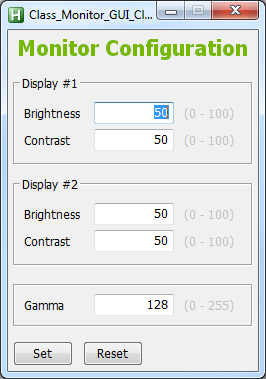

# Monitor Class (WinAPI) by jNizM

## Converted Monitor Functions
* DestroyPhysicalMonitor()
* DestroyPhysicalMonitors()
* GetMonitorBrightness()
* GetMonitorColorTemperature()
* GetMonitorContrast()
* GetNumberOfPhysicalMonitorsFromHMONITOR()
* GetPhysicalMonitorsFromHMONITOR()
* SetMonitorBrightness()
* SetMonitorColorTemperature()
* SetMonitorContrast()
* GetDeviceGammaRamp()
* SetDeviceGammaRamp()
* MonitorFromWindow()
* EnumDisplayMonitors()
* MonitorEnumProc()

## Examples:
### Classic GUI (Brightness, Contrast & Gamma)

## Info
* URL: [AHK Thread](http://ahkscript.org/boards/viewtopic.php?f=6&t=7854)

## Contributing
* special thanks to just me & SKAN
* thanks to AutoHotkey Community

## Copyright and License
[Unlicense](LICENSE)