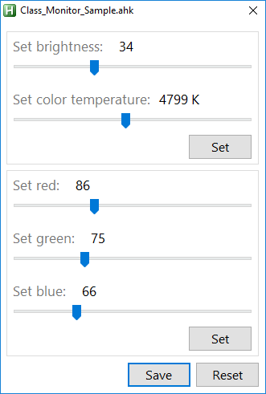

# AHK Monitor Class
Set monitors brightness and color temperature

## Example
### Sample with Settings-Gui (Brightness, Color-Temperature or Red-Green-Blue manually)

## Info
* [AHK Thread](https://autohotkey.com/boards/viewtopic.php?t=7854)
* [GetDeviceGammaRamp](https://msdn.microsoft.com/en-us/library/dd316946(v=vs.85).aspx)
* [SetDeviceGammaRamp](https://msdn.microsoft.com/en-us/library/dd372194(v=vs.85).aspx)
* [How to Convert Temperature (K) to RGB](http://www.tannerhelland.com/4435/convert-temperature-rgb-algorithm-code/)

## Contributing
* thanks to AutoHotkey Community

## Questions / Bugs / Issues
Report any bugs or issues on the [AHK Thread](https://autohotkey.com/boards/viewtopic.php?t=7854). Same for any questions.

## Copyright and License
[Unlicense](LICENSE)

## Donations
[Donations are appreciated if I could help you](https://www.paypal.me/smithz)